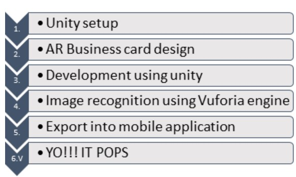

# AR-BUSINESS-CARD
A Simple business card might not have all the information related to you, but in an AR Business card, we get more detailed information with more reality and less paperwork.AR business card uses live image tracking technology, which is available for both ios and Android, the application can detect and track the card.

- PREREQUISITES:
 -Unity 3D
- Unity package
- Vuforia Engine
-  ARCore/AR Kit
- AR Foundation
- XR Plugin management Package

## FLOW CHART:

                          
## UNITY SETUP:
1. After installing Unity Hub and opening, we will click on “New,” then select “3D” as a template, name the project and select its location. Then we click on “Create.”
2. We have saved the given design package “Assembly.unitypackage” and open the file.
3. We click on Import.
4. On the left, under “Sample Scene,” we have to delete both “Main Camera” and ‘Directional Light” and Save.
5. We go to the “GameObject” tab and select “Vuforia Engine” and then “AR Camera.”
6. We left Click on “AR Camera” and then select “Vuforia Engine” and then select “Image.” We would notice that we have “Image Target: added underneath AR Camera. Then we save.
7. Now we have to add the database, so we go to https://developer.vuforia.com/vui/auth/register to register with your information, then we say “create an account,” and a link will be sent to the email address for verification. 
8. Now we login to https://developer.vuforia.com/vui/auth/login with the previously set email and password.
9. After getting logged in, we click “Get Development Key” and then proceed to “License Manager” where we will enter a License name and then check the box below and click “Confirm.”
10. Now that we have a license created, we click on it and copy the given license key.
11. We then close that window and select “AR Camera,” and on the right, we select “Open Vuforia Engine Configuration” and paste the License key we copied. Then we click “Add License.”
12. Now, we go back to Vuforia and select the “Target Manager” tab. We click on “Add Database”. We give it a name and check Type “ Device” then click “create”.
13. Now that we have created a database, we have to add targets. We click on it and then select “Add Target”.
14. We then Select Type “Single Image”. We browse to “AR Business card.jpg”. Then we say the width is “1” and select “Add”.
15. Then we add our 2nd Target following the same steps but choosing “Untitled.jpg” instead.
16. Then we add our 3rd Target by Selecting Type “3D Object” and browsing to “7gc.od” and then clicking “Add”.
17. Now that we have our database with our targets, we select “Download Database All” and then check “Unity Editor”. Then select “Download”.
18. We open the file we just downloaded and select “Import”.

## AR BUSINESS CARD DESIGN:  
Our AR business card would be designed in such a way that proper solid shapes and colors are used to make the image recognition possible. 
## AR DEVELOPMENT:
1.Under “AR Camera”, we create an “Image Target”.
2.We go to image Target and select the previously created database and “AR business card” as Target.
3.Now we have to add the buttons required .In this case ,we have added Instagram,Youtube,Gmail,Facebook,Phone Number,Website buttons.
4.We have to change the source image of buttons and change the size of buttons accordingly.
5.We will create an empty game object and rename it as codes to add C# codes.
6.We open the script and delete "start()" and "update()".
7.Now,we add the method "buttonfunction()" and add the line  “Application.OpenURL();”
8.Then we pick the script and drop it in “Button”for that object and add the required link by selecting button3d.buttonfunction .
9.We repeat the same steps above for the rest of the social media links.
All the pngs used and code for adding urls are present in the files above.
 
## IMAGE RECOGNITION USING VUFORIA:
Vuforia supports 2D as well as 3D object recognition. The required target will be scanned using the Object Scanner app provided by the Vuforia engine for Android. We need to add this target to the Targets database online, similar to how we added the image targets.
1. We select AR Camera ->Vuforia Engine ->3D Scan.
2. We make sure that the Target is 66.od.
3. Then, we include the controls from the business card under ObjectTarget.
4. Set the position of the objects to 0 so that they would be close to the object target. And adjust the placement according to the requirement.

## EXPORT INTO MOBILE APP:
1. We go to file  Build Settings
2. Then we select “Add Open Scenes.”
3. Then, we select the preferred platforms. In this case, it’s iOS or Android.
4. Now, we select “Switch Platform” and then select “Build and Run.”

## OTHER APPLICATION:
Apart from the A.R. business card, Auguemented reality concept can be used in other ways as well like:
1. As a poster: The popups from the card can be used as animations from the posters.
2. To showcase movie trailers and clips 
3. Can be modified into a Greeting card and postcard. Inclusion of pictures, popups, animations would help.
## WORK DONE SO FAR:
We have installed the unity hub and downloaded all the required packages like Vuforia engine, unity package,  AR foundation …. 
Since one of our team mates tested positive for covid-19 ,we couldn’t start the design work yet .But we make sure that we will complete the project in time .
## ISSUES FACED:
Initially we had a error while installing unity engine 2020 version as it didn’t have in built vuforia engine .So we are using the 2019 version for convenience
